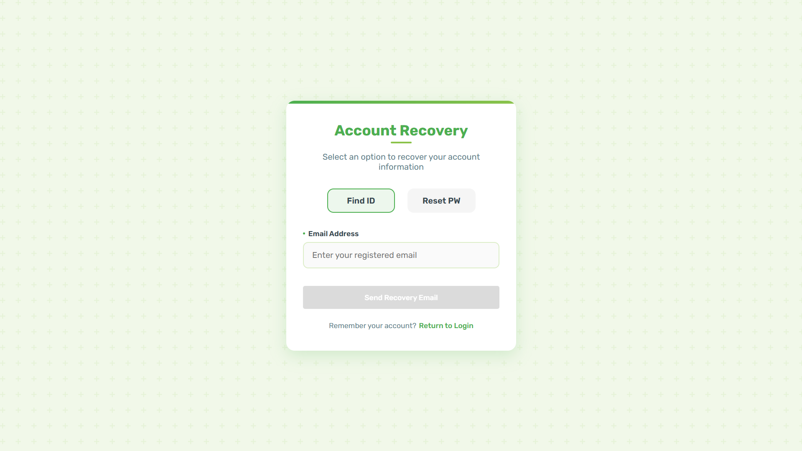
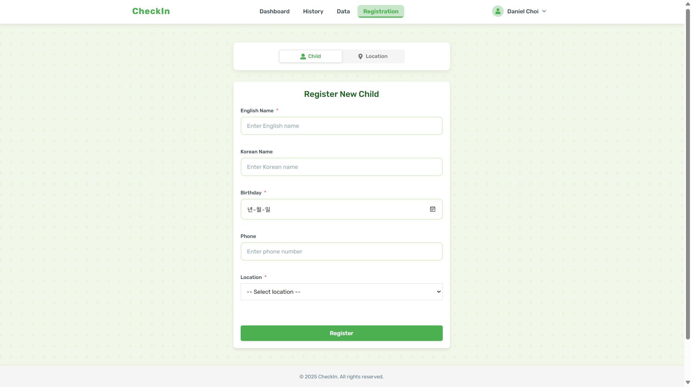
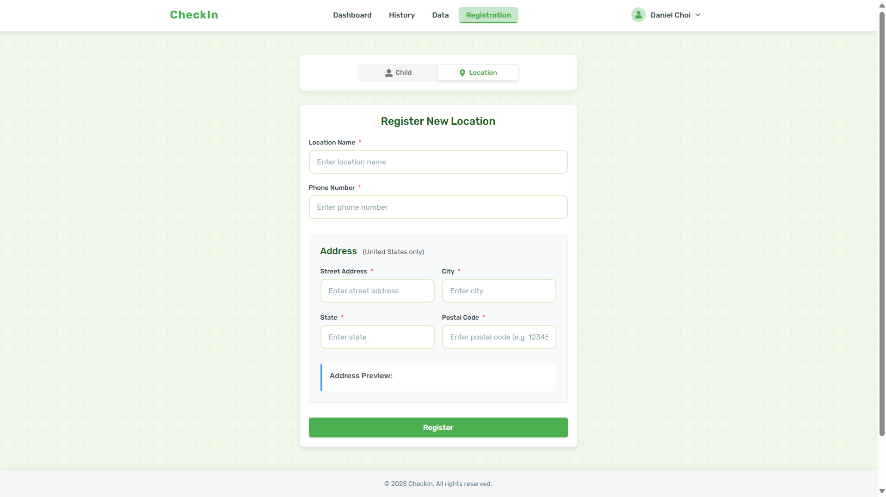

# Check-In Service

A modern web application for managing child check-ins at educational facilities. Built with React and Node.js.

---

### Project Overview

The Check-In Service is designed to enhance child safety and security in educational facilities. In an era where child protection is paramount, this system provides a robust, digital solution to prevent unauthorized pick-ups and ensure children's safety from potential risks such as kidnapping or abduction.

### Key Safety Features
- Secure QR code-based verification system for authorized pick-ups
- Real-time notifications to guardians when their child is checked in/out
- Comprehensive tracking of all check-in/out activities

### Target Users
- Educational Facilities (Kindergartens, Schools, Academies)
- Parents and Legal Guardians
- Facility Administrators and Staff
- Child Safety Organizations

---

## Features

### Authentication & User Management
- Multi-role user system (Admin, Manager, Guardian)
- Social login support (Google, Kakao)
- Password recovery and account management

### Check-In System
- QR code-based check-in system
- Real-time check-in status updates
- Multiple camera support for QR scanning
- Instant notifications to guardians

### Location Management
- Multiple location support
- QR code generation for each location
- Location-specific check-in history

### Child Management
- Child registration and guardian assignment
- Check-in history tracking
- Email notifications for guardians

---

## Tech Stack

### Frontend
| Category | Technologies |
|----------|-------------|
| Core | React 19 |
| Build Tool | Vite |
| Routing | React Router v6 |
| Network | Axios |
| UI/UX | React Icons, React Hot Toast, React Toastify |
| Forms | Formik, Yup |
| QR Scanning | HTML5-QRCode |

### Backend
| Category | Technologies                           |
|----------|----------------------------------------|
| Runtime | Node.js                                |
| Framework | Express.js                             |
| Database | MySQL                                  |
| ORM | Sequelize                              |
| Authentication | Passport.js, JWT                       |
| Security | bcryptjs, helmet, express-rate-limit   |
| Session | express-session, express-mysql-session |
| Caching | node-cache                             |
| QR Code | QRCode                                 |
| Email | Nodemailer                             |
| Validation | express-validator                      |
| Development | nodemon                                |

---

## Getting Started

### Prerequisites
- Node.js
- MySQL
- npm or yarn

### Installation

1. Clone the repository
```bash
git clone [repository-url]
```

2. Install backend dependencies
```bash
cd checkin_api
npm install
```

3. Install frontend dependencies
```bash
cd checkin_ui
npm install
```

4. Configure environment variables
- Create `.env` files in both frontend and backend directories
- Set up necessary environment variables based on `.env.example`

5. Start the development servers

Backend:
```bash
cd checkin_api
npm run dev
```

Frontend:
```bash
cd checkin_ui
npm run dev
```

---

## Project Structure

### Frontend Structure
```
checkin_ui/
├── src/
│   ├── assets/         # Static assets and styles
│   ├── components/     # Reusable components
│   ├── hooks/         # Custom React hooks
│   ├── pages/         # Page components
│   ├── services/      # API service layers
│   └── validations/   # Form validation schemas
```

### Backend Structure
```
checkin_api/
├── app/
│   ├── configs/       # Configuration files
│   ├── controllers/   # Request handlers
│   ├── middlewares/   # Custom middlewares
│   ├── models/        # Database models
│   ├── routes/        # API routes
│   ├── services/      # Business logic
│   └── validations/   # Input validation
├── migrations/        # Database migrations
└── seeders/          # Database seeders
```

---

## Security Features
- Session-based authentication
- Rate limiting for login attempts
- Secure password hashing
- CORS protection
- Input validation and sanitization

---

## Data Migrations
Run each seed file in order:
```bash
npx sequelize-cli db:seed --seed 20250626220647-demo-location.js
npx sequelize-cli db:seed --seed 20250626220226-demo-user.js
npx sequelize-cli db:seed --seed 20250626220855-demo-child.js
npx sequelize-cli db:seed --seed 20250626221248-demo-userChild.js
```

---

## UX/UI Documentation (Updated on 07/05/2025)

### 1. Authentication & Registration
- **Login**
  - Landing page with login form
  
- **Registration Flow**
  - Initial registration form
  
  - Form with validation
  
  - Email verification
  
- **Account Recovery**
  - ID/Password recovery page
  

### 2. Main Dashboard
- **User Dashboard**
  - Basic view
  
  - With child information and SMS settings
  
- **Manager Dashboard**
  - Basic view
  
  - With child information
  
  - Pull up QR code for each location (for user checkin)
  
- **Admin Dashboard**
  - Overview page
  

### 3. Guardian Invitation System
- **Manager Interface**
  - Send invitation email
  
- **Admin Interface**
  - Send invitation email with location selection
  

### 4. Check-in System
- **User Check-in**
  - QR Scanner interface
  
  - Successful check-in confirmation
  
- **Manager/Admin Check-in**
  - Manual check-in interface
  
- **Check-in notification to guardians**
- 

### 5. Child Registration System
- **Manager Interface**
  - Basic registration form
  
  - Form with validation
  
- **Admin Interface**
  - Child registration
  
  - Child registration with validation
  
  - Location registration
  
  - Location registration with validation
  

### 6. History Tracking
- Universal history page (access levels vary by role)
  - User: Access to their children's records only
  - Manager: Access to facility children's records
  - Admin: Access to all records across locations
  

### 7. Profile Management
- **Role-specific Profile Pages**
  - User profile
  
  - Manager profile
  
  - Admin profile
  
- **Profile Actions**
  - Password change interface
  
  - Profile update interface
  